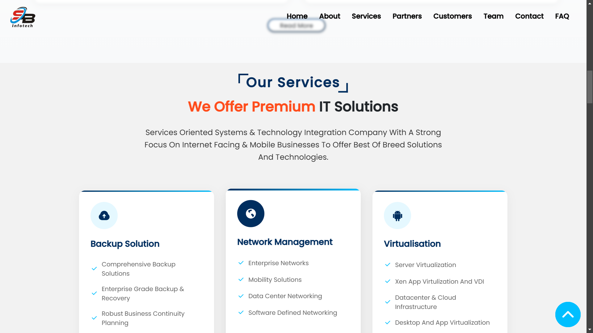
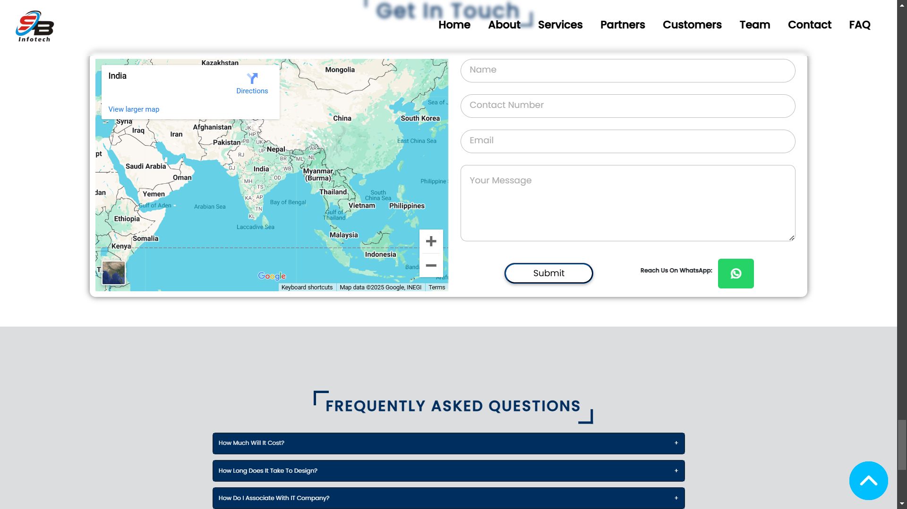

# IT Website

A responsive and interactive IT website built primarily using **HTML**, **CSS**, and **JavaScript**. This website is designed to showcase IT services, solutions, and other related information in an engaging manner.

---

## Features

- **Modern Design:** A clean and professional look with a focus on user experience.
- **Responsive Layout:** Optimized for devices of all sizes—desktop, tablet, and mobile.
- **Interactive Elements:** Smooth animations and transitions powered by JavaScript and GSAP.
- **Customizable Sections:** Modular design to easily update or add new sections.

---

## Technologies Used

- **HTML**: For the structure of the website.
- **CSS**: For styling, including modern layouts like Flexbox and Grid.
- **JavaScript**: For interactive functionality and animations.

---

## Installation and Usage

1. Clone this repository:
   ```bash
   git clone https://github.com/kishankumar1047/Internship_Website.git
